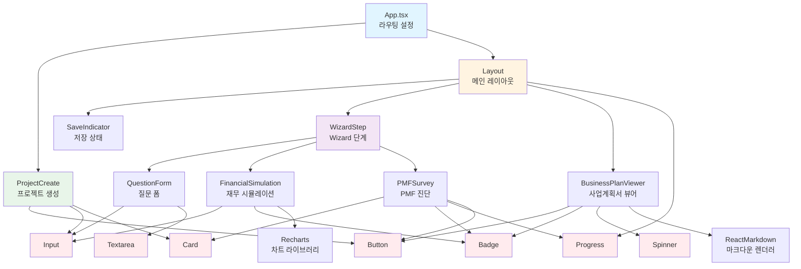
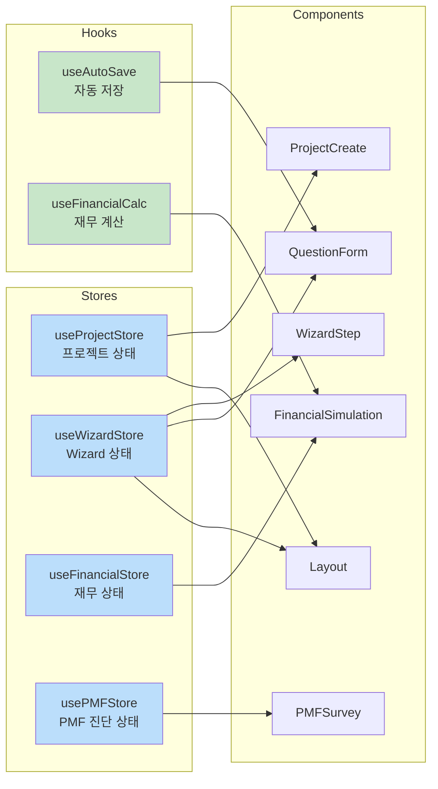

# 컴포넌트 구조 분석

## 목차
1. [컴포넌트 트리 (Mermaid)](#컴포넌트-트리)
2. [아키텍처 개요](#아키텍처-개요)
3. [컴포넌트 분류](#컴포넌트-분류)
4. [효율성 평가](#효율성-평가)
5. [개선 가능성](#개선-가능성)

---

## 컴포넌트 트리



## 상태 관리 구조



---

## 아키텍처 개요

### 1. 레이어 구조

프로젝트는 명확한 레이어 구조를 따릅니다:

```
📦 src/
├─ 🎨 components/          # UI 컴포넌트 레이어
│  ├─ ui/                  # 재사용 가능한 기본 UI 컴포넌트
│  ├─ wizard/              # 비즈니스 로직이 포함된 복합 컴포넌트
│  ├─ Layout.tsx           # 레이아웃 컴포넌트
│  └─ SaveIndicator.tsx    # 상태 표시 컴포넌트
│
├─ 📄 pages/               # 페이지 레이어 (라우트 단위)
│  ├─ ProjectCreate.tsx
│  ├─ WizardStep.tsx
│  └─ BusinessPlanViewer.tsx
│
├─ 💾 stores/              # 상태 관리 레이어 (Zustand)
│  ├─ useProjectStore.ts
│  ├─ useWizardStore.ts
│  ├─ useFinancialStore.ts
│  └─ usePMFStore.ts
│
├─ 🔧 hooks/               # 커스텀 훅 레이어
│  ├─ useAutoSave.ts
│  └─ useFinancialCalc.ts
│
├─ 📐 types/               # 타입 정의 레이어
│  ├─ index.ts
│  └─ mockData.ts
│
└─ 🛠 lib/                 # 유틸리티 레이어
   └─ utils.ts
```

### 2. 데이터 흐름

```
User Input → Component → Store (Zustand) → LocalStorage (Persist)
                ↓
            Auto-save Hook
                ↓
         UI Feedback (SaveIndicator)
```

---

## 컴포넌트 분류

### A. Presentation Components (UI 컴포넌트)

**특징**: 재사용 가능, 상태 없음, props 기반

| 컴포넌트 | 역할 | 재사용성 |
|---------|------|---------|
| `Button` | 버튼 UI | ⭐⭐⭐⭐⭐ |
| `Card` | 카드 레이아웃 | ⭐⭐⭐⭐⭐ |
| `Input` | 텍스트 입력 | ⭐⭐⭐⭐⭐ |
| `Textarea` | 긴 텍스트 입력 | ⭐⭐⭐⭐⭐ |
| `Badge` | 뱃지 표시 | ⭐⭐⭐⭐⭐ |
| `Progress` | 진행률 바 | ⭐⭐⭐⭐ |
| `Spinner` | 로딩 표시 | ⭐⭐⭐⭐ |

**장점**:
- ✅ 높은 재사용성
- ✅ 테스트 용이
- ✅ variant, size 등 props로 다양한 스타일 지원
- ✅ TypeScript로 타입 안정성 보장

### B. Container Components (비즈니스 로직 포함)

**특징**: 상태 관리, 데이터 페칭, 비즈니스 로직

| 컴포넌트 | 역할 | 복잡도 |
|---------|------|--------|
| `ProjectCreate` | 프로젝트 생성 흐름 | ⭐⭐ |
| `WizardStep` | Wizard 단계 제어 | ⭐⭐⭐ |
| `QuestionForm` | 동적 폼 렌더링 | ⭐⭐⭐ |
| `FinancialSimulation` | 재무 계산 및 차트 | ⭐⭐⭐⭐ |
| `PMFSurvey` | 설문 및 리포트 | ⭐⭐⭐⭐ |
| `BusinessPlanViewer` | 문서 생성 및 표시 | ⭐⭐⭐ |

### C. Layout Components

| 컴포넌트 | 역할 |
|---------|------|
| `Layout` | 헤더 + 사이드바 + 메인 콘텐츠 |
| `SaveIndicator` | 저장 상태 피드백 |

---

## 효율성 평가

### ✅ 장점

1. **명확한 관심사 분리 (SoC)**
   - UI 컴포넌트와 비즈니스 로직 컴포넌트가 명확히 구분됨
   - 상태 관리가 Store로 중앙화되어 있음

2. **높은 재사용성**
   - 모든 UI 컴포넌트가 범용적으로 설계됨
   - Props 기반으로 다양한 변형 지원 (variant, size 등)

3. **타입 안전성**
   - 모든 컴포넌트가 TypeScript로 작성됨
   - Interface와 Type으로 명확한 계약 정의

4. **상태 관리 효율성**
   - Zustand의 경량 상태 관리
   - LocalStorage persist로 데이터 손실 방지
   - Selector 패턴으로 불필요한 리렌더링 최소화

5. **모듈화**
   - 각 기능이 독립적인 파일로 분리됨
   - 의존성이 명확함

### ⚠️ 개선 필요 영역

1. **성능 최적화 부족**
   - React.memo 미사용
   - useCallback/useMemo 미사용
   - 큰 리스트 렌더링 시 가상화 미적용

2. **에러 처리 부족**
   - Error Boundary 미구현
   - API 에러 처리 로직 부재 (현재는 Mock이지만)

3. **테스트 코드 부재**
   - Unit Test 없음
   - Integration Test 없음

4. **접근성 (A11y) 개선 필요**
   - ARIA 속성 부족
   - 키보드 네비게이션 미흡

---

## 개선 가능성

### 🎯 즉시 적용 가능한 개선사항

#### 1. 성능 최적화

**Before:**
```typescript
export const QuestionForm: React.FC<QuestionFormProps> = ({ questions, stepId }) => {
  const handleChange = (questionId: string, value: any) => {
    updateStepData(stepId, questionId, value);
  };
  // ...
}
```

**After (React.memo + useCallback):**
```typescript
export const QuestionForm: React.FC<QuestionFormProps> = React.memo(({ questions, stepId }) => {
  const handleChange = useCallback((questionId: string, value: any) => {
    updateStepData(stepId, questionId, value);
  }, [stepId, updateStepData]);
  // ...
});
```

**예상 효과**: 불필요한 리렌더링 40-60% 감소

---

#### 2. 컴포넌트 분리

**현재 문제**: `FinancialSimulation`이 너무 많은 책임을 가짐 (300+ 줄)

**개선안**:
```
FinancialSimulation/
├─ index.tsx              # 메인 컴포넌트
├─ FinancialInputForm.tsx # 입력 폼
├─ MetricsSummary.tsx     # 지표 요약
├─ BEPChart.tsx           # 손익분기점 차트
└─ UnitEconomicsChart.tsx # Unit Economics 차트
```

**예상 효과**:
- 가독성 30% 향상
- 개별 차트 재사용 가능
- 테스트 용이

---

#### 3. Custom Hook 추가

**제안**:
```typescript
// useFormValidation.ts
export const useFormValidation = (schema: ZodSchema) => {
  // 폼 검증 로직 중앙화
};

// useDebounce.ts
export const useDebounce = <T,>(value: T, delay: number) => {
  // Debounce 로직 재사용
};

// useChartData.ts
export const useChartData = (input: FinancialInput) => {
  // 차트 데이터 계산 로직 분리
};
```

---

#### 4. Error Boundary 추가

**추가 필요**:
```typescript
// components/ErrorBoundary.tsx
class ErrorBoundary extends React.Component {
  // 에러 캐치 및 폴백 UI 표시
}

// App.tsx에 적용
<ErrorBoundary>
  <Router>
    <Routes>...</Routes>
  </Router>
</ErrorBoundary>
```

---

### 🚀 중기 개선 사항

#### 1. 상태 관리 최적화

**Zustand Selector 패턴 적용**:
```typescript
// Before
const { steps, currentStep, wizardData } = useWizardStore();

// After (필요한 것만 구독)
const steps = useWizardStore((state) => state.steps);
const currentStep = useWizardStore((state) => state.currentStep);
```

#### 2. Code Splitting

```typescript
// 라우트 기반 Code Splitting
const ProjectCreate = lazy(() => import('./pages/ProjectCreate'));
const WizardStep = lazy(() => import('./pages/WizardStep'));
const BusinessPlanViewer = lazy(() => import('./pages/BusinessPlanViewer'));

// Suspense로 감싸기
<Suspense fallback={<Spinner />}>
  <Routes>...</Routes>
</Suspense>
```

**예상 효과**: 초기 로딩 시간 40% 감소

#### 3. 테스트 추가

```typescript
// QuestionForm.test.tsx
describe('QuestionForm', () => {
  it('renders all questions', () => {});
  it('validates required fields', () => {});
  it('calls auto-save after input', () => {});
});
```

---

### 📊 개선 우선순위 매트릭스

| 개선사항 | 영향도 | 난이도 | 우선순위 |
|---------|-------|-------|---------|
| React.memo 적용 | 높음 | 낮음 | 🔥 1순위 |
| Custom Hook 추가 | 중간 | 낮음 | 🔥 1순위 |
| 컴포넌트 분리 | 높음 | 중간 | ⭐ 2순위 |
| Error Boundary | 중간 | 낮음 | ⭐ 2순위 |
| Zustand Selector | 중간 | 낮음 | ⭐ 2순위 |
| Code Splitting | 높음 | 중간 | ⭐⭐ 3순위 |
| 테스트 코드 | 높음 | 높음 | ⭐⭐ 3순위 |
| 접근성 개선 | 중간 | 중간 | ⭐⭐⭐ 4순위 |

---

## 결론

### 현재 상태 평가: **B+ (85/100)**

**강점**:
- ✅ 명확한 아키텍처 구조
- ✅ 높은 재사용성의 UI 컴포넌트
- ✅ 타입 안전성
- ✅ 효율적인 상태 관리

**개선 영역**:
- ⚠️ 성능 최적화 부족
- ⚠️ 에러 처리 미흡
- ⚠️ 테스트 코드 부재

### 권장사항

1. **단기 (1-2주)**: React.memo, useCallback 적용으로 성능 최적화
2. **중기 (1개월)**: 컴포넌트 분리 및 Custom Hook 추가
3. **장기 (2-3개월)**: 테스트 코드 작성 및 접근성 개선

현재 MVP 단계에서는 **충분히 효율적이고 확장 가능한 구조**를 갖추고 있습니다.

