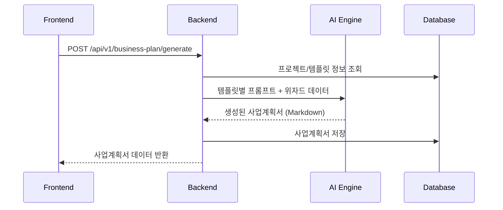

# 백엔드 통합 구현 방안

> 템플릿별 사업계획서 작성 기능의 프론트엔드-백엔드 연동 가이드

## 목차

1. [개요](#1-개요)
2. [API 설계](#2-api-설계)
3. [데이터베이스 스키마](#3-데이터베이스-스키마)
4. [AI 프롬프트 템플릿](#4-ai-프롬프트-템플릿)
5. [연동 순서](#5-연동-순서)
6. [보안 고려사항](#6-보안-고려사항)

---

## 1. 개요

### 1.1 구현 완료된 프론트엔드 기능

| 기능 | 파일 | 설명 |
|------|------|------|
| 템플릿별 질문 데이터 | `src/types/templateQuestions.ts` | 예비/초기창업패키지 6단계 질문 |
| 템플릿 테마 | `src/constants/templateThemes.ts` | UI 테마, 자금 구조 상수 |
| 가이드 박스 | `src/components/wizard/GuideBox.tsx` | 작성 팁, 예시, 주의사항 |
| 예비창업 계산기 | `src/components/wizard/PreStartupBudgetCalculator.tsx` | 1단계+2단계 자금 계획 |
| 초기창업 계산기 | `src/components/wizard/EarlyStartupBudgetCalculator.tsx` | 매칭펀드 계산기 |
| 마스킹 유틸 | `src/utils/dataMasking.ts` | 개인정보 마스킹 |
| 마스킹 미리보기 | `src/components/wizard/MaskingPreview.tsx` | 마스킹 결과 UI |

### 1.2 백엔드 연동이 필요한 기능

1. **템플릿별 사업계획서 생성 API**
   - 예비창업패키지용 프롬프트
   - 초기창업패키지용 프롬프트

2. **자금 집행계획 검증 API**
   - 1단계/2단계 예산 검증 (예비창업)
   - 매칭펀드 비율 검증 (초기창업)

3. **개인정보 마스킹 API**
   - 서버 사이드 마스킹 (다운로드 시)

4. **문서 생성 API**
   - HWP/PDF 템플릿 적용
   - 양식별 포맷팅

---

## 2. API 설계

### 2.1 사업계획서 생성 API

#### 엔드포인트

```
POST /api/v1/business-plan/generate
```

#### Request Body

```json
{
  "templateType": "pre-startup" | "early-startup",
  "projectId": "uuid",
  "wizardData": {
    "1": {
      "item-name": "LearnAI",
      "deliverables": "웹 서비스 1종, 모바일 앱 2종...",
      "team-status": "대표자(OOO): 서비스 기획...",
      "item-summary": "AI 기반 맞춤형 학습 플랫폼...",
      "differentiation": "1. 적응형 AI 알고리즘..."
    },
    "2": { ... },
    "3": {
      "development-plan": "...",
      "budget-phase1": "...",
      "budget-phase2": "...",
      "budgetPhases": [
        {
          "phase": 1,
          "items": [
            { "id": "phase1-materials", "amount": 3000000, "description": "..." }
          ]
        }
      ]
    },
    ...
  },
  "financialData": {
    "customers": 1000,
    "pricePerCustomer": 35000,
    ...
  },
  "options": {
    "maskPersonalInfo": true,
    "outputFormat": "markdown" | "hwp" | "pdf"
  }
}
```

#### Response Body

```json
{
  "success": true,
  "data": {
    "id": "uuid",
    "templateType": "pre-startup",
    "sections": [
      {
        "id": "overview",
        "title": "1. 일반현황 및 개요",
        "content": "## 아이템명\n\nLearnAI (범주: 에듀테크)...",
        "order": 1
      },
      ...
    ],
    "financialSummary": {
      "totalBudget": 60000000,
      "phase1": 20000000,
      "phase2": 40000000
    },
    "generatedAt": "2024-12-28T10:00:00Z"
  }
}
```

### 2.2 자금 집행계획 검증 API

#### 엔드포인트

```
POST /api/v1/budget/validate
```

#### Request Body (예비창업패키지)

```json
{
  "templateType": "pre-startup",
  "budgetPhases": [
    {
      "phase": 1,
      "maxAmount": 20000000,
      "items": [
        { "id": "phase1-materials", "name": "재료비", "amount": 3000000 },
        { "id": "phase1-outsourcing", "name": "외주용역비", "amount": 12000000 },
        { "id": "phase1-labor", "name": "인건비", "amount": 5000000 }
      ]
    },
    {
      "phase": 2,
      "maxAmount": 40000000,
      "items": [...]
    }
  ]
}
```

#### Request Body (초기창업패키지)

```json
{
  "templateType": "early-startup",
  "matchingFund": {
    "totalBudget": 150000000,
    "governmentFund": 105000000,
    "selfCash": 15000000,
    "selfInKind": 30000000,
    "items": [
      { "id": "labor", "name": "인건비", "amount": 50000000 },
      ...
    ]
  }
}
```

#### Response Body

```json
{
  "success": true,
  "data": {
    "isValid": true,
    "validations": [
      { "rule": "phase1_max", "passed": true, "message": "1단계 예산이 한도 내입니다" },
      { "rule": "phase2_max", "passed": true, "message": "2단계 예산이 한도 내입니다" }
    ],
    "warnings": [
      { "type": "ratio", "message": "외주용역비 비율이 높습니다 (60%). 검토를 권장합니다." }
    ]
  }
}
```

### 2.3 문서 다운로드 API

#### 엔드포인트

```
POST /api/v1/documents/export
```

#### Request Body

```json
{
  "businessPlanId": "uuid",
  "format": "hwp" | "pdf",
  "templateType": "pre-startup" | "early-startup",
  "options": {
    "maskPersonalInfo": true,
    "includeFinancialTables": true,
    "headerTemplate": "2026_예비창업패키지_양식"
  }
}
```

#### Response

- Content-Type: `application/vnd.hancom.hwp` 또는 `application/pdf`
- Content-Disposition: `attachment; filename="사업계획서_LearnAI.hwp"`

---

## 3. 데이터베이스 스키마

### 3.1 템플릿 관련 테이블

```sql
-- 템플릿 정의
CREATE TABLE template_definitions (
    id VARCHAR(50) PRIMARY KEY,
    name VARCHAR(100) NOT NULL,
    short_name VARCHAR(20),
    description TEXT,
    budget_structure_type ENUM('two-phase', 'matching-fund', 'loan') NOT NULL,
    is_active BOOLEAN DEFAULT true,
    created_at TIMESTAMP DEFAULT CURRENT_TIMESTAMP,
    updated_at TIMESTAMP DEFAULT CURRENT_TIMESTAMP ON UPDATE CURRENT_TIMESTAMP
);

-- 템플릿별 단계 정의
CREATE TABLE template_steps (
    id BIGINT AUTO_INCREMENT PRIMARY KEY,
    template_id VARCHAR(50) NOT NULL,
    step_number INT NOT NULL,
    title VARCHAR(100) NOT NULL,
    description TEXT,
    icon VARCHAR(10),
    guide_box JSON,
    created_at TIMESTAMP DEFAULT CURRENT_TIMESTAMP,
    FOREIGN KEY (template_id) REFERENCES template_definitions(id),
    UNIQUE KEY uk_template_step (template_id, step_number)
);

-- 템플릿별 질문 정의
CREATE TABLE template_questions (
    id BIGINT AUTO_INCREMENT PRIMARY KEY,
    template_step_id BIGINT NOT NULL,
    question_id VARCHAR(50) NOT NULL,
    question_type ENUM('text', 'textarea', 'number', 'select') NOT NULL,
    label VARCHAR(200) NOT NULL,
    description TEXT,
    placeholder TEXT,
    is_required BOOLEAN DEFAULT false,
    guide TEXT,
    examples JSON,
    warnings JSON,
    display_order INT DEFAULT 0,
    created_at TIMESTAMP DEFAULT CURRENT_TIMESTAMP,
    FOREIGN KEY (template_step_id) REFERENCES template_steps(id)
);

-- 초기 데이터 삽입
INSERT INTO template_definitions (id, name, short_name, description, budget_structure_type) VALUES
('pre-startup', '예비창업패키지', '예창패', '아이디어 실현 가능성 증명', 'two-phase'),
('early-startup', '초기창업패키지', '초창패', '시장성 검증 및 성장', 'matching-fund');
```

### 3.2 사업계획서 저장 테이블

```sql
-- 사업계획서
CREATE TABLE business_plans (
    id CHAR(36) PRIMARY KEY,
    project_id CHAR(36) NOT NULL,
    template_id VARCHAR(50) NOT NULL,
    wizard_data JSON NOT NULL,
    financial_data JSON,
    budget_data JSON,
    generated_content JSON,
    status ENUM('draft', 'generated', 'exported') DEFAULT 'draft',
    created_at TIMESTAMP DEFAULT CURRENT_TIMESTAMP,
    updated_at TIMESTAMP DEFAULT CURRENT_TIMESTAMP ON UPDATE CURRENT_TIMESTAMP,
    FOREIGN KEY (template_id) REFERENCES template_definitions(id)
);

-- 자금 집행계획 (예비창업패키지)
CREATE TABLE budget_phases (
    id BIGINT AUTO_INCREMENT PRIMARY KEY,
    business_plan_id CHAR(36) NOT NULL,
    phase_number INT NOT NULL,
    phase_name VARCHAR(100),
    max_amount DECIMAL(15,2),
    total_amount DECIMAL(15,2),
    items JSON NOT NULL,
    created_at TIMESTAMP DEFAULT CURRENT_TIMESTAMP,
    FOREIGN KEY (business_plan_id) REFERENCES business_plans(id)
);

-- 매칭펀드 (초기창업패키지)
CREATE TABLE matching_funds (
    id BIGINT AUTO_INCREMENT PRIMARY KEY,
    business_plan_id CHAR(36) NOT NULL,
    total_budget DECIMAL(15,2) NOT NULL,
    government_fund DECIMAL(15,2) NOT NULL,
    self_cash DECIMAL(15,2) NOT NULL,
    self_in_kind DECIMAL(15,2) NOT NULL,
    items JSON NOT NULL,
    validation_result JSON,
    created_at TIMESTAMP DEFAULT CURRENT_TIMESTAMP,
    FOREIGN KEY (business_plan_id) REFERENCES business_plans(id)
);
```

---

## 4. AI 프롬프트 템플릿

### 4.1 예비창업패키지용 시스템 프롬프트

```markdown
당신은 정부지원사업 예비창업패키지 사업계획서 작성을 돕는 전문 컨설턴트입니다.

## 역할
- 예비창업자가 아이디어의 '실현 가능성(Feasibility)'을 증명할 수 있도록 도움
- 정부지원사업 심사위원의 관점에서 평가 가능한 문서 작성
- 협약 기간 내 완료 가능한 현실적인 계획 수립 지원

## 작성 원칙
1. 대표자 개인의 개발/사업화 능력 강조
2. 아이디어를 구체적인 '개발 계획'과 '물리적 산출물'로 변환
3. 1단계(2천만 원) + 2단계(4천만 원) 자금 구조에 맞춘 계획
4. ESG 실천 계획 필수 포함

## 제약사항
- 개인정보(이름, 학교 등)는 'OOO' 형태로 마스킹
- 과장된 표현 자제, 근거 기반 서술
- 거창한 확장보다 MVP 완성에 집중

## 출력 형식
마크다운 형식으로 작성하며, 각 섹션은 정부 양식 항목에 맞춤
```

### 4.2 초기창업패키지용 시스템 프롬프트

```markdown
당신은 정부지원사업 초기창업패키지 사업계획서 작성을 돕는 전문 컨설턴트입니다.

## 역할
- 초기 스타트업이 제품의 '시장성(Marketability)'을 검증할 수 있도록 도움
- 투자 유치 및 시장 확장 가능성을 어필할 수 있는 문서 작성
- 기존 트랙 레코드를 활용한 성장 전략 수립 지원

## 작성 원칙
1. 팀의 조직적 수행 능력 강조
2. 기존 제품/서비스의 시장 검증 데이터(트랙 레코드) 활용
3. 매칭펀드 구조(정부 70% + 현금 10% + 현물 20%)에 맞춘 계획
4. 투자 유치 계획(Pre-A, Series A 등) 구체화

## 제약사항
- 개인정보(이름, 학교 등)는 'OOO' 형태로 마스킹
- 측정 가능한 KPI와 마일스톤 제시
- TAM/SAM/SOM 시장 규모 분석 포함

## 출력 형식
마크다운 형식으로 작성하며, 각 섹션은 정부 양식 항목에 맞춤
```

### 4.3 섹션별 프롬프트 예시

```typescript
// 예비창업패키지 - 문제인식 섹션
const problemSectionPrompt = `
## 작성 섹션: 문제인식 (Problem)

### 입력 데이터
- 시장 현황: ${wizardData['2']['market-status']}
- 시장의 문제점: ${wizardData['2']['pain-points']}
- 아이템 개발 필요성: ${wizardData['2']['necessity']}

### 작성 요구사항
1. 기존 시장의 빈틈(Gap)을 데이터로 제시
2. "왜 지금, 이 아이템이어야 하는가"에 대한 논리적 당위성 서술
3. 시장 규모, 성장률, 고객 불만족 데이터 등 객관적 수치 활용

### 출력 형식
## 1. 시장 현황
(시장 분석 내용)

## 2. 시장의 문제점 (Pain Point)
(문제점 분석)

## 3. 아이템 개발 필요성
(필요성 서술)
`;
```

---

## 5. 연동 순서

### 5.1 Phase 1: 기본 연동 (1주)



#### 구현 항목
1. `BusinessPlanController.java` - 생성 API 엔드포인트
2. `BusinessPlanService.java` - 비즈니스 로직
3. `TemplatePromptService.java` - 템플릿별 프롬프트 생성
4. `AIGenerationService.java` - AI API 호출

### 5.2 Phase 2: 자금 검증 (3일)

```typescript
// 프론트엔드 연동 예시
const validateBudget = async (budgetData: BudgetPhase[]) => {
  const response = await axios.post('/api/v1/budget/validate', {
    templateType: 'pre-startup',
    budgetPhases: budgetData,
  });
  
  if (!response.data.isValid) {
    // 검증 실패 처리
    showValidationErrors(response.data.validations);
  }
};
```

### 5.3 Phase 3: 문서 내보내기 (1주)

#### HWP 템플릿 구조

```
/templates
  /hwp
    /2026_예비창업패키지
      - header.xml
      - section_overview.xml
      - section_problem.xml
      - section_solution.xml
      - section_growth.xml
      - section_team.xml
      - section_financial.xml
    /2026_초기창업패키지
      - ...
```

#### 문서 생성 서비스

```java
@Service
public class DocumentExportService {
    
    public byte[] exportToHwp(BusinessPlan plan, ExportOptions options) {
        // 1. 템플릿 로드
        HwpTemplate template = loadTemplate(plan.getTemplateType());
        
        // 2. 개인정보 마스킹 (옵션)
        if (options.isMaskPersonalInfo()) {
            plan = maskingService.mask(plan);
        }
        
        // 3. 섹션별 데이터 바인딩
        template.bind("overview", plan.getSections().get("overview"));
        template.bind("problem", plan.getSections().get("problem"));
        // ...
        
        // 4. HWP 파일 생성
        return template.render();
    }
}
```

---

## 6. 보안 고려사항

### 6.1 개인정보 보호

```java
@Service
public class MaskingService {
    
    private static final List<MaskingPattern> PATTERNS = List.of(
        new MaskingPattern("korean-name", Pattern.compile("([가-힣]{2,4})\\s*(대표|사장|CEO)"), "OOO $2"),
        new MaskingPattern("phone", Pattern.compile("\\d{2,3}-\\d{3,4}-\\d{4}"), "010-****-****"),
        new MaskingPattern("email", Pattern.compile("[\\w.]+@[\\w.]+"), "***@***.***"),
        new MaskingPattern("university", Pattern.compile("([가-힣]+)(대학교|대학원)"), "OO$2")
    );
    
    public String mask(String text) {
        String result = text;
        for (MaskingPattern pattern : PATTERNS) {
            result = pattern.apply(result);
        }
        return result;
    }
}
```

### 6.2 데이터 암호화

```yaml
# application.yml
security:
  encryption:
    algorithm: AES-256-GCM
    key-rotation: monthly
  
  sensitive-fields:
    - wizard_data.team-status
    - wizard_data.founder-capability
    - financial_data
```

### 6.3 접근 제어

```java
@PreAuthorize("@businessPlanSecurity.canAccess(#projectId)")
@PostMapping("/business-plan/generate")
public ResponseEntity<BusinessPlan> generate(
    @RequestBody GenerateRequest request,
    @AuthenticationPrincipal User user
) {
    // 워크스페이스 격리 검증
    if (!workspaceService.hasAccess(user, request.getProjectId())) {
        throw new AccessDeniedException("프로젝트에 대한 접근 권한이 없습니다.");
    }
    // ...
}
```

---

## 부록: 프론트엔드 API 서비스 구현

### A.1 API 서비스 파일

```typescript
// src/services/templateBusinessPlanApi.ts

import axios from 'axios';
import { TemplateType } from '../types';
import { WizardData } from '../types';

const API_BASE = '/api/v1';

export interface GenerateRequest {
  templateType: TemplateType;
  projectId: string;
  wizardData: WizardData;
  financialData?: Record<string, number>;
  options?: {
    maskPersonalInfo?: boolean;
    outputFormat?: 'markdown' | 'hwp' | 'pdf';
  };
}

export interface BudgetValidationRequest {
  templateType: TemplateType;
  budgetPhases?: BudgetPhase[];
  matchingFund?: MatchingFund;
}

// 사업계획서 생성
export const generateBusinessPlan = async (request: GenerateRequest) => {
  const response = await axios.post(`${API_BASE}/business-plan/generate`, request);
  return response.data;
};

// 자금 집행계획 검증
export const validateBudget = async (request: BudgetValidationRequest) => {
  const response = await axios.post(`${API_BASE}/budget/validate`, request);
  return response.data;
};

// 문서 다운로드
export const exportDocument = async (
  businessPlanId: string,
  format: 'hwp' | 'pdf',
  options?: { maskPersonalInfo?: boolean }
) => {
  const response = await axios.post(
    `${API_BASE}/documents/export`,
    { businessPlanId, format, options },
    { responseType: 'blob' }
  );
  return response.data;
};
```

### A.2 Zustand Store 확장

```typescript
// src/stores/useWizardStore.ts 확장

interface WizardState {
  // ... 기존 상태
  
  // 백엔드 연동 상태
  isSyncing: boolean;
  lastSyncedAt: string | null;
  syncError: string | null;
  
  // 백엔드 연동 액션
  syncToBackend: () => Promise<void>;
  loadFromBackend: (projectId: string) => Promise<void>;
}

// 구현
syncToBackend: async () => {
  const state = get();
  if (!state.templateType) return;
  
  set({ isSyncing: true, syncError: null });
  
  try {
    await axios.put(`/api/v1/projects/${state.projectId}/wizard-data`, {
      templateType: state.templateType,
      wizardData: state.wizardData,
      currentStep: state.currentStep,
    });
    
    set({ isSyncing: false, lastSyncedAt: new Date().toISOString() });
  } catch (error) {
    set({ isSyncing: false, syncError: '저장에 실패했습니다.' });
  }
},
```

---

## 결론

이 문서는 프론트엔드에서 구현 완료된 템플릿별 사업계획서 작성 기능을 백엔드와 연동하기 위한 가이드입니다.

### 주요 연동 포인트

1. **템플릿별 질문 데이터**: 프론트엔드 → 백엔드 저장/조회
2. **자금 집행계획**: 실시간 검증 API 연동
3. **AI 프롬프트**: 템플릿별 차별화된 프롬프트 적용
4. **문서 내보내기**: 정부 양식에 맞는 HWP/PDF 생성

### 예상 소요 기간

| Phase | 내용 | 소요 기간 |
|-------|------|----------|
| 1 | 기본 API 연동 | 1주 |
| 2 | 자금 검증 API | 3일 |
| 3 | 문서 내보내기 | 1주 |
| 4 | 통합 테스트 | 3일 |

**총 예상 소요: 약 3주**

---

*문서 작성일: 2024-12-28*
*작성자: AI Assistant*

