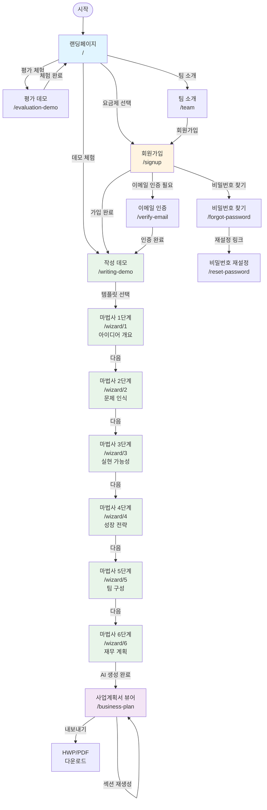
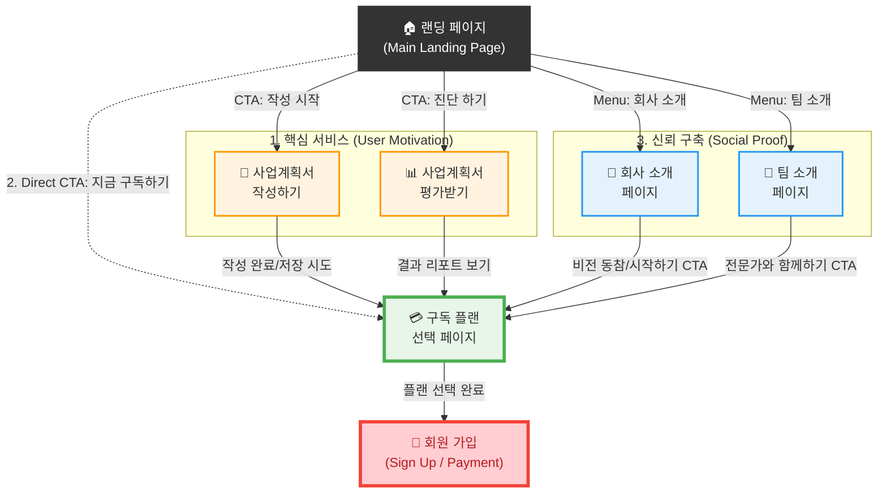
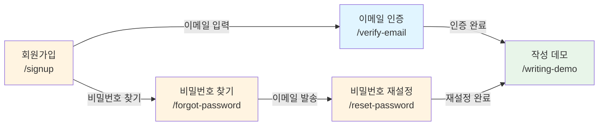
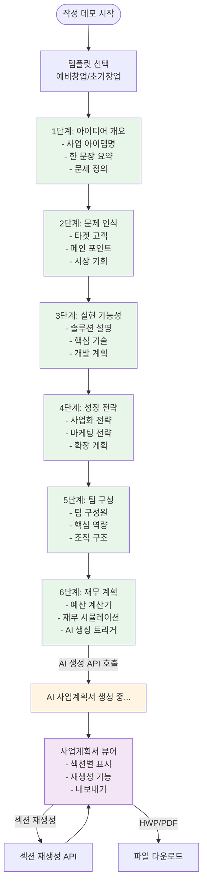
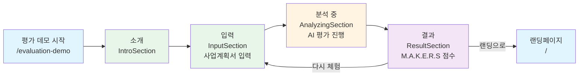

# 프런트엔드 페이지 명세서

> **작성일**: 2025년 1월 21일  
> **프로젝트**: Makers Round - M.A.K.E.R.S AI 심사위원단  
> **목적**: 현재 구현된 프런트엔드 페이지 현황 분석 및 UX 흐름도 정리

---

## 📋 목차

1. [개요](#개요)
2. [페이지 목록](#페이지-목록)
3. [페이지 상세 명세](#페이지-상세-명세)
4. [UX 흐름도](#ux-흐름도)
5. [라우팅 구조](#라우팅-구조)
6. [구현 상태 요약](#구현-상태-요약)

---

## 개요

본 문서는 Makers Round 프런트엔드 애플리케이션의 현재 구현 상태를 분석하여 모든 페이지를 나열하고, 사용자 경험(UX) 흐름을 트리 형태로 정리한 명세서입니다.

### 기술 스택
- **프레임워크**: React 18 + TypeScript
- **라우팅**: React Router v6
- **상태 관리**: Zustand
- **스타일링**: Tailwind CSS

---

## 페이지 목록

### 공개 페이지 (인증 불필요)

| # | 페이지명 | 경로 | 컴포넌트 | 설명 |
|---|---------|------|---------|------|
| 1 | **랜딩페이지** | `/` | `LandingPage` | 메인 랜딩페이지 (고객 유입) |
| 2 | **팀 소개** | `/team` | `TeamPage` | MakersWorld 팀 소개 페이지 |
| 3 | **회원가입** | `/signup` | `SignupPage` | 회원가입 (요금제 선택 통합) |
| 4 | **이메일 인증** | `/verify-email` | `VerifyEmailPage` | 이메일 인증 처리 페이지 |
| 5 | **비밀번호 찾기** | `/forgot-password` | `ForgotPasswordPage` | 비밀번호 재설정 요청 |
| 6 | **비밀번호 재설정** | `/reset-password` | `ResetPasswordPage` | 비밀번호 재설정 처리 |
| 7 | **작성 데모** | `/writing-demo` | `ProjectCreate` | 사업계획서 작성 데모 시작 |
| 8 | **평가 데모** | `/evaluation-demo` | `EvaluationDemoPage` | AI 심사위원단 평가 체험 |

### 인증 필요 페이지 (Layout 적용)

| # | 페이지명 | 경로 | 컴포넌트 | 설명 |
|---|---------|------|---------|------|
| 9 | **마법사 1단계** | `/wizard/1` | `WizardStep` | 아이디어 개요 (사업 아이템명) |
| 10 | **마법사 2단계** | `/wizard/2` | `WizardStep` | 문제 인식 (Problem) |
| 11 | **마법사 3단계** | `/wizard/3` | `WizardStep` | 실현 가능성 (Solution) |
| 12 | **마법사 4단계** | `/wizard/4` | `WizardStep` | 성장 전략 (Scale-up) |
| 13 | **마법사 5단계** | `/wizard/5` | `WizardStep` | 팀 구성 (Team) |
| 14 | **마법사 6단계** | `/wizard/6` | `WizardStep` | 재무 계획 (Financial) |
| 15 | **사업계획서 뷰어** | `/business-plan` | `BusinessPlanViewer` | AI 생성 사업계획서 조회/편집 |

**총 페이지 수**: 15개 (공개 8개 + 인증 필요 7개)

---

## 페이지 상세 명세

### 1. 랜딩페이지 (`/`)

**컴포넌트**: `LandingPage`  
**파일 경로**: `src/pages/LandingPage.tsx`

#### 주요 기능
- 비디오 배경 + 3D 텍스트 플립 애니메이션
- 체험 피드백 캐러셀 (21개 후기)
- M.A.K.E.R.S AI 심사위원단 소개
- 요금제 비교 및 선택
- 사전등록 프로모션 배너
- CTA 버튼 (회원가입, 데모 체험)

#### 섹션 구성
1. **Fixed Header**: 로고, 네비게이션, BGM 토글, CTA
2. **Primary Hero**: 비디오 배경 + 메인 메시지
3. **체험 피드백**: 4개 그룹별 자동 스크롤 캐러셀
4. **AI 심사위원단**: M.A.K.E.R.S 6대 평가 영역 소개
5. **사업분야 맞춤지원**: 창업 유형별 + 도메인별 컨설팅
6. **요금제 비교**: 기본/플러스/프로/프리미엄
7. **프로모션 배너**: Phase A/B 할인 정보
8. **Footer**: 팀 소개, 문의

#### 네비게이션
- `/signup?plan={planKey}` - 요금제 선택 후 회원가입
- `/writing-demo` - 작성 데모 시작
- `/evaluation-demo` - 평가 데모 시작
- `/team` - 팀 소개

---

### 2. 회원가입 (`/signup`)

**컴포넌트**: `SignupPage`  
**파일 경로**: `src/pages/SignupPage.tsx`

#### 주요 기능
- 이메일/비밀번호 가입 폼
- 소셜 로그인 버튼 (Google, Kakao, Naver) - Mocked
- 약관 동의 체크박스
- 선택한 요금제 표시 및 저장
- 프로모션 할인 정보 및 카운트다운 표시
- 유료 요금제 선택 시 전화번호/사업분야 필수 입력

#### URL 파라미터
- `plan`: 선택한 요금제 (기본, 플러스, 프로, 프리미엄)

#### 데이터 흐름
1. 랜딩페이지에서 요금제 선택 → `/signup?plan=프로` 이동
2. 회원가입 폼 작성 및 약관 동의
3. 유료 요금제 + 프로모션 활성 시 사전등록 API 호출
4. 가입 완료 시 `useAuthStore`에 사용자 정보 저장
5. `/writing-demo` 페이지로 리다이렉트

#### 네비게이션
- `/writing-demo` - 가입 완료 후 이동
- `/verify-email` - 이메일 인증 필요 시

---

### 3. 이메일 인증 (`/verify-email`)

**컴포넌트**: `VerifyEmailPage`  
**파일 경로**: `src/pages/VerifyEmailPage.tsx`

#### 주요 기능
- URL 파라미터로 받은 토큰으로 이메일 인증 처리
- 인증 성공/실패 메시지 표시
- 재발송 기능 제공

#### URL 파라미터
- `token`: 이메일 인증 토큰

#### 상태
- `loading`: 인증 처리 중
- `success`: 인증 성공
- `error`: 인증 실패
- `no-token`: 토큰 없음

---

### 4. 비밀번호 찾기 (`/forgot-password`)

**컴포넌트**: `ForgotPasswordPage`  
**파일 경로**: `src/pages/ForgotPasswordPage.tsx`

#### 주요 기능
- 이메일 입력으로 비밀번호 재설정 링크 요청
- 요청 성공 메시지 표시

#### 상태
- `form`: 폼 입력 단계
- `loading`: 요청 처리 중
- `success`: 요청 성공

---

### 5. 비밀번호 재설정 (`/reset-password`)

**컴포넌트**: `ResetPasswordPage`  
**파일 경로**: `src/pages/ResetPasswordPage.tsx`

#### 주요 기능
- URL 파라미터로 받은 토큰으로 비밀번호 재설정
- 새 비밀번호 입력 및 확인
- 재설정 성공/실패 메시지 표시

#### URL 파라미터
- `token`: 비밀번호 재설정 토큰

#### 상태
- `form`: 폼 입력 단계
- `loading`: 재설정 처리 중
- `success`: 재설정 성공
- `error`: 재설정 실패

---

### 6. 팀 소개 (`/team`)

**컴포넌트**: `TeamPage`  
**파일 경로**: `src/pages/TeamPage.tsx`

#### 주요 기능
- MakersWorld 대표 소개
- MakersRound AI 개발진 소개
- 8개 사업 도메인별 비즈니스 컨설턴트 소개
- 최종 CTA: 회원가입 (요금제 선택 → 가입)

#### 네비게이션
- `/signup` - 회원가입으로 이동

---

### 7. 작성 데모 (`/writing-demo`)

**컴포넌트**: `ProjectCreate`  
**파일 경로**: `src/pages/ProjectCreate.tsx`

#### 주요 기능
- 템플릿 선택 (예비창업패키지/초기창업패키지/정책자금)
- 프로젝트 생성 후 마법사 단계로 이동
- 프로젝트명(사업 아이템명)은 마법사 1단계에서 입력

#### 템플릿 타입
- `pre-startup`: 예비창업패키지
- `early-startup`: 초기창업패키지
- `bank-loan`: 정책자금 (미지원)

#### 데이터 흐름
1. 사용자 입력 (템플릿) → 로컬 state
2. 제출 시 → `useProjectStore`에 저장 (임시 이름으로 생성)
3. 마법사 초기화 → `useWizardStore.resetWizard()`
4. 페이지 이동 → `/wizard/1` (사업 아이템명 입력)

#### 네비게이션
- `/wizard/1` - 첫 번째 마법사 단계로 이동

---

### 8. 평가 데모 (`/evaluation-demo`)

**컴포넌트**: `EvaluationDemoPage`  
**파일 경로**: `src/pages/EvaluationDemoPage/index.tsx`

#### 주요 기능
- M.A.K.E.R.S 6대 핵심 평가 영역 체험
- 사업계획서 입력 및 AI 평가 결과 확인

#### 단계 구성
1. **intro**: 소개 (`IntroSection`)
2. **input**: 입력 (`InputSection`)
3. **analyzing**: 분석 (`AnalyzingSection`)
4. **result**: 결과 (`ResultSection`)

#### 상태 관리
- `useEvaluationStore`: 평가 데모 단계 및 데이터 관리

---

### 9-14. 마법사 단계 (`/wizard/:stepId`)

**컴포넌트**: `WizardStep`  
**파일 경로**: `src/pages/WizardStep.tsx`  
**레이아웃**: `Layout` 컴포넌트 적용

#### 단계별 상세

##### 1단계: 아이디어 개요 (`/wizard/1`)
- **제목**: 일반현황 및 개요
- **주요 입력**:
  - 사업 아이템명 (필수)
  - 한 문장 요약 (필수)
  - 해결하고자 하는 문제 (필수)
  - 문제 증거/데이터

##### 2단계: 문제 인식 (`/wizard/2`)
- **제목**: 문제 인식 (Problem)
- **PSST 프레임워크**: Problem
- **주요 입력**:
  - 타겟 고객 정의
  - 고객 페인 포인트
  - 시장 규모 및 기회

##### 3단계: 실현 가능성 (`/wizard/3`)
- **제목**: 실현 가능성 (Solution)
- **PSST 프레임워크**: Solution
- **주요 입력**:
  - 솔루션 설명
  - 핵심 기술/차별화 포인트
  - 개발 계획

##### 4단계: 성장 전략 (`/wizard/4`)
- **제목**: 성장 전략 (Scale-up)
- **PSST 프레임워크**: Scale-up
- **주요 입력**:
  - 사업화 전략
  - 마케팅 전략
  - 확장 계획

##### 5단계: 팀 구성 (`/wizard/5`)
- **제목**: 팀 구성 (Team)
- **PSST 프레임워크**: Team
- **주요 입력**:
  - 팀 구성원 정보
  - 핵심 역량
  - 조직 구조

##### 6단계: 재무 계획 (`/wizard/6`)
- **제목**: 재무 계획 (Financial)
- **주요 입력**:
  - 예비창업패키지 예산 계산기 (`PreStartupBudgetCalculator`)
  - 초기창업패키지 예산 계산기 (`EarlyStartupBudgetCalculator`)
  - 재무 시뮬레이션
- **특수 기능**: AI 사업계획서 생성 (백엔드 API 호출)

#### 데이터 흐름
1. URL (`/wizard/:stepId`) → `stepId` 추출 → 해당 단계 렌더링
2. 사용자 입력 → 각 단계 컴포넌트 → `useWizardStore` 업데이트
3. 완료 시 → 백엔드 API 호출 → 응답 저장 → `/business-plan` 이동

#### 사용하는 Store
- `useWizardStore`: 마법사 진행 상태 및 단계별 데이터
- `useBusinessPlanStore`: 생성된 사업계획서 데이터
- `useProjectStore`: 프로젝트 정보

#### 네비게이션
- 이전 단계: `goToPreviousStep()`
- 다음 단계: `goToNextStep()`
- 마지막 단계 완료 시: `/business-plan` 이동

---

### 15. 사업계획서 뷰어 (`/business-plan`)

**컴포넌트**: `BusinessPlanViewer`  
**파일 경로**: `src/pages/BusinessPlanViewer.tsx`  
**레이아웃**: `Layout` 컴포넌트 적용

#### 주요 기능
- AI 생성 사업계획서 표시 (마크다운 형식)
- 섹션별 재생성 기능
- HWP/PDF 내보내기 기능

#### 데이터 흐름
1. `useBusinessPlanStore`에서 생성된 데이터 조회
2. 데이터가 없으면 Wizard로 리다이렉트
3. 생성 완료 → 섹션별 사업계획서 표시
4. 각 섹션마다 "다시 쓰기" 버튼으로 재생성 가능
5. HWP/PDF 내보내기 가능

#### 기능
- 섹션별 재생성: `handleRegenerate(sectionId)`
- 파일 내보내기: `handleExport(format)` (HWP/PDF)

---

## UX 흐름도

### 전체 사용자 여정



### 목표하던 랜딩 페이지 퍼널링 전략과 차이점 분석

#### 계획된 퍼널링 모델



#### 차이점 분석

##### 1. **퍼널 구조의 차이**

| 구분 | 계획된 모델 | 현재 구현 |
|------|------------|----------|
| **전환 경로** | 랜딩 → 서비스 체험 → **구독 플랜 선택** → 회원가입 | 랜딩 → **직접 회원가입** 또는 데모 체험 → 회원가입 |
| **구독 플랜 선택** | 별도 페이지 (`Plan_Select`) 존재 | 회원가입 페이지에 통합 (`/signup?plan={planKey}`) |
| **서비스 체험 후 전환** | 체험 완료 → 구독 플랜 선택 페이지 → 회원가입 | 체험 완료 → 랜딩으로 복귀 또는 직접 회원가입 |

##### 2. **주요 차이점 상세**

**✅ 계획된 모델의 특징:**
- **명확한 퍼널 단계**: 랜딩 → 서비스 체험 → 구독 플랜 선택 → 회원가입
- **전환 유도 전략**: 서비스 체험 중 기능 제한으로 유료 전환 유도
- **구독 플랜 선택 페이지**: 회원가입 전 요금제 비교 및 선택 단계 분리
- **다양한 진입 경로**: 서비스 체험, 회사/팀 소개 등 다양한 경로에서 구독 플랜 선택으로 수렴

**⚠️ 현재 구현의 특징:**
- **직접 회원가입 경로**: 랜딩에서 바로 회원가입 가능 (요금제 선택 포함)
- **통합된 회원가입**: 구독 플랜 선택이 회원가입 페이지에 통합됨
- **데모 체험 경로**: 데모 체험 후 랜딩으로 복귀 (명확한 전환 유도 부재)
- **간소화된 플로우**: 구독 플랜 선택 페이지가 별도로 존재하지 않음

##### 3. **퍼널링 전략 비교**

| 전략 요소 | 계획된 모델 | 현재 구현 | 영향 |
|----------|------------|----------|------|
| **서비스 체험 → 전환** | 체험 완료 시 구독 플랜 선택 페이지로 유도 | 체험 완료 후 랜딩 복귀 | ⚠️ 전환 기회 손실 가능 |
| **구독 플랜 선택** | 별도 페이지로 요금제 비교 강조 | 회원가입 페이지에 통합 | ⚠️ 요금제 비교 인지도 감소 |
| **직접 전환 경로** | 랜딩에서 구독 플랜 선택으로 직접 이동 가능 | 랜딩에서 바로 회원가입 | ✅ 빠른 전환 경로 제공 |
| **정보 페이지 활용** | 회사/팀 소개 → 구독 플랜 선택 | 팀 소개 → 회원가입 | ⚠️ 중간 단계 생략 |

##### 4. **개선 제안**

**현재 구현의 장점:**
- ✅ 빠른 전환 경로 제공 (랜딩 → 바로 회원가입)
- ✅ 간소화된 사용자 여정 (단계 감소)
- ✅ 회원가입 페이지에서 요금제 선택 통합 (컨텍스트 유지)

**계획된 모델의 장점:**
- ✅ 서비스 체험 후 자연스러운 전환 유도
- ✅ 구독 플랜 선택 페이지에서 요금제 비교 강조
- ✅ 다양한 진입 경로에서 구독 플랜 선택으로 수렴

**하이브리드 접근 제안:**
1. **데모 체험 완료 후**: 구독 플랜 선택 페이지로 리다이렉트 (전환 유도)
2. **구독 플랜 선택 페이지 추가**: `/pricing` 또는 `/plans` 경로 신설
3. **회원가입 페이지**: 구독 플랜 선택 페이지에서 요금제 선택 후 이동
4. **랜딩 페이지 CTA**: "지금 구독하기" → 구독 플랜 선택 페이지로 이동

##### 5. **퍼널 단계별 비교표**

| 퍼널 단계 | 계획된 모델 | 현재 구현 | 상태 |
|----------|------------|----------|------|
| **1. 진입** | 랜딩 페이지 | 랜딩 페이지 | ✅ 동일 |
| **2. 서비스 체험** | 작성 데모 / 평가 데모 | 작성 데모 / 평가 데모 | ✅ 동일 |
| **3. 신뢰 구축** | 회사 소개 / 팀 소개 | 팀 소개 | ⚠️ 회사 소개 페이지 없음 |
| **4. 전환 유도** | 구독 플랜 선택 페이지 | 회원가입 페이지 (요금제 통합) | ⚠️ 별도 페이지 없음 |
| **5. 최종 목표** | 회원가입 + 결제 | 회원가입 (요금제 선택 포함) | ✅ 유사 |

**결론**: 현재 구현은 **간소화된 퍼널**을 제공하지만, 계획된 모델의 **구독 플랜 선택 페이지**가 없어 서비스 체험 후 전환 유도가 약할 수 있습니다. 데모 체험 완료 후 구독 플랜 선택 페이지로 리다이렉트하는 로직 추가를 권장합니다.

### 인증 플로우



### 마법사 플로우 (상세)



### 평가 데모 플로우



---

## 라우팅 구조

### React Router 설정 (`App.tsx`)

```typescript
<Routes>
  {/* 공개 페이지 */}
  <Route path="/" element={<LandingPage />} />
  <Route path="/signup" element={<SignupPage />} />
  <Route path="/verify-email" element={<VerifyEmailPage />} />
  <Route path="/forgot-password" element={<ForgotPasswordPage />} />
  <Route path="/reset-password" element={<ResetPasswordPage />} />
  <Route path="/team" element={<TeamPage />} />
  <Route path="/writing-demo" element={<ProjectCreate />} />
  <Route path="/evaluation-demo" element={<EvaluationDemoPage />} />
  
  {/* Layout 적용 페이지 (인증 필요) */}
  <Route element={<Layout />}>
    <Route path="/wizard/:stepId" element={<WizardStep />} />
    <Route path="/business-plan" element={<BusinessPlanViewer />} />
  </Route>
  
  {/* 404 처리 */}
  <Route path="*" element={<Navigate to="/" replace />} />
</Routes>
```

### 라우팅 규칙

1. **공개 페이지**: 인증 없이 접근 가능
2. **Layout 페이지**: `Layout` 컴포넌트로 감싸져 공통 헤더/사이드바 제공
3. **404 처리**: 모든 미정의 경로는 루트(`/`)로 리다이렉트

---

## 구현 상태 요약

### ✅ 완료된 페이지 (15개)

| 페이지 | 상태 | 비고 |
|--------|------|------|
| 랜딩페이지 | ✅ 완료 | 모든 섹션 구현 완료 |
| 회원가입 | ✅ 완료 | 프로모션 통합 완료 |
| 이메일 인증 | ✅ 완료 | 토큰 검증 구현 |
| 비밀번호 찾기 | ✅ 완료 | 이메일 발송 구현 |
| 비밀번호 재설정 | ✅ 완료 | 토큰 검증 구현 |
| 팀 소개 | ✅ 완료 | 프로필 및 컨설턴트 소개 |
| 작성 데모 | ✅ 완료 | 템플릿 선택 구현 |
| 평가 데모 | ✅ 완료 | 4단계 플로우 구현 |
| 마법사 1-6단계 | ✅ 완료 | PSST 프레임워크 기반 |
| 사업계획서 뷰어 | ✅ 완료 | 마크다운 렌더링, 재생성 기능 |

### 🔄 개선 필요 사항

1. **인증 상태 관리**
   - Layout 페이지에 인증 가드 미적용 (현재는 모든 사용자 접근 가능)
   - 인증되지 않은 사용자의 `/wizard/*`, `/business-plan` 접근 제한 필요

2. **에러 처리**
   - 네트워크 에러 시 사용자 피드백 강화
   - API 실패 시 재시도 로직

3. **로딩 상태**
   - AI 생성 중 사용자 경험 개선 (진행률 표시)
   - 페이지 전환 시 로딩 인디케이터

4. **접근성**
   - 키보드 네비게이션 지원
   - 스크린 리더 호환성

### 📊 페이지별 기능 완성도

| 페이지 | 기능 완성도 | UI/UX | 백엔드 연동 |
|--------|------------|-------|------------|
| 랜딩페이지 | 100% | ✅ | ✅ |
| 회원가입 | 95% | ✅ | ✅ |
| 이메일 인증 | 100% | ✅ | ✅ |
| 비밀번호 찾기 | 100% | ✅ | ✅ |
| 비밀번호 재설정 | 100% | ✅ | ✅ |
| 팀 소개 | 100% | ✅ | N/A |
| 작성 데모 | 100% | ✅ | ✅ |
| 평가 데모 | 90% | ✅ | ⚠️ Mock |
| 마법사 단계 | 95% | ✅ | ✅ |
| 사업계획서 뷰어 | 90% | ✅ | ⚠️ 부분 연동 |

**범례**:
- ✅ 완료
- ⚠️ 부분 완료
- ❌ 미구현

---

## 참고 자료

- [React Router v6 공식 문서](https://reactrouter.com/)
- [Zustand 상태 관리](https://zustand-demo.pmnd.rs/)
- [프로젝트 README](../README.md)
- [컴포넌트 구조 분석](./01-component-structure-analysis.md)
- [함수 호출 구조](./04-function-call-hierarchy.md)

---

**문서 버전**: 1.0  
**최종 업데이트**: 2025년 1월 21일
