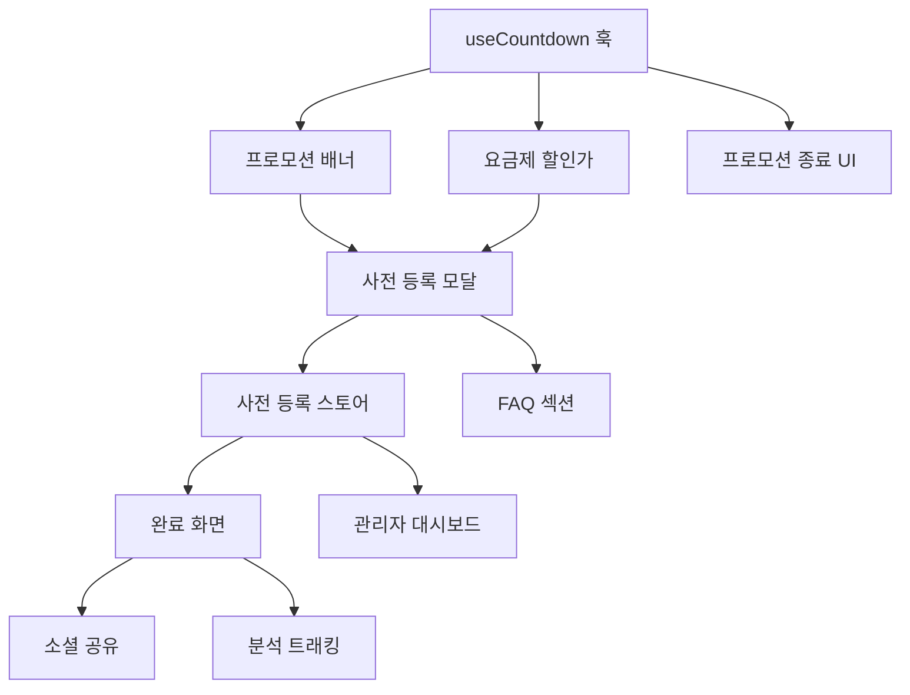

# Pre-Subscription Campaign TODO List

> **프로모션 기간:** 2025년 12월 26일 ~ 2026년 1월 5일
> **혜택:** 2단계 얼리버드 할인 사전 등록
> **목표:** 잠재 수요 검증 및 얼리버드 회원 확보

---

## 🗓️ 프로모션 기간별 혜택

| 기간 | 할인율 | 설명 |
|------|--------|------|
| **Phase A: 연말 특별** | 🔥 **30% 할인** | 2025-12-26 ~ 2025-12-31 (6일간) |
| **Phase B: 신년 얼리버드** | ✨ **20% 할인** | 2026-01-01 ~ 2026-01-05 (5일간) |

---

## 📊 할인 요금 계산

### 🔥 Phase A: 연말 특별 30% 할인 (12/26 ~ 12/31)

| 요금제 | 정가 | 30% 할인가 | 절약 금액 |
|--------|------|-----------|----------|
| 플러스 | ₩399,000 | **₩279,300** | ₩119,700 |
| 프로 | ₩799,000 | **₩559,300** | ₩239,700 |
| 프리미엄 | ₩1,499,000 | **₩1,049,300** | ₩449,700 |

### ✨ Phase B: 신년 얼리버드 20% 할인 (1/1 ~ 1/5)

| 요금제 | 정가 | 20% 할인가 | 절약 금액 |
|--------|------|-----------|----------|
| 플러스 | ₩399,000 | **₩319,200** | ₩79,800 |
| 프로 | ₩799,000 | **₩639,200** | ₩159,800 |
| 프리미엄 | ₩1,499,000 | **₩1,199,200** | ₩299,800 |

### 📈 할인율 비교 요약

| 요금제 | 정가 | 30% 할인 (연말) | 20% 할인 (신년) | 추가 절약 (연말) |
|--------|------|----------------|----------------|-----------------|
| 플러스 | ₩399,000 | ₩279,300 | ₩319,200 | +₩39,900 |
| 프로 | ₩799,000 | ₩559,300 | ₩639,200 | +₩79,900 |
| 프리미엄 | ₩1,499,000 | ₩1,049,300 | ₩1,199,200 | +₩149,900 |

---

## 🎯 Phase 1: 핵심 UI 컴포넌트 (필수)

### 1.1 프로모션 배너 컴포넌트

**우선순위:** 🔴 Critical
**예상 소요:** 2-3시간

**작업 내용:**
- 페이지 최상단 고정 배너 (sticky header 위 또는 아래)
- 프로모션 문구 + 카운트다운 타이머 + CTA 버튼
- 닫기 버튼 + localStorage 기반 숨김 처리
- 모바일 반응형 디자인

**AI 에이전트 프롬프트:**

```markdown
## Context
현재 프로젝트는 React 18 + TypeScript + Tailwind CSS 기반의 랜딩페이지입니다.
기존 스타일은 글래스모피즘(glass-card 클래스)과 그라데이션을 활용합니다.

## Task
페이지 최상단에 고정되는 프로모션 배너 컴포넌트를 만들어주세요.

## Requirements
1. **위치:** Fixed header 바로 위 또는 아래, 전체 너비
2. **내용:**
   - 왼쪽: 할인율 배지 (연말 30% / 신년 20% 자동 전환)
   - 중앙: "🔥 연말 특별 30% 할인" 또는 "✨ 신년 얼리버드 20% 할인" + 카운트다운
   - 오른쪽: "지금 등록하기" CTA 버튼 + 닫기(X) 버튼
3. **스타일:**
   - 연말(30%): 배경 그라데이션 (rose-500 → orange-500) - 더 강렬한 색상
   - 신년(20%): 배경 그라데이션 (emerald-500 → cyan-500)
   - 텍스트: 흰색, font-medium
   - 높이: 48px (모바일), 40px (데스크톱)
4. **기능:**
   - 닫기 버튼 클릭 시 localStorage에 저장하여 24시간 숨김
   - 2단계 카운트다운:
     - 12/31 23:59:59까지: "30% 할인 마감까지"
     - 1/5 23:59:59까지: "20% 할인 마감까지"
   - 종료 시 "프로모션이 종료되었습니다" 표시
5. **반응형:**
   - 모바일: 타이머만 표시, 탭 시 전체 내용 확장
   - 태블릿 이상: 전체 내용 한 줄 표시

## Technical Constraints
- src/components/ui/PromotionBanner.tsx 파일로 생성
- 카운트다운 로직은 useEffect + setInterval 사용
- date-fns 또는 순수 JS Date 객체 사용
- 기존 index.css의 애니메이션 클래스 재활용

## Output Format
완성된 컴포넌트 코드와 LandingPage.tsx에 추가하는 방법을 함께 제공해주세요.
```

---

### 1.2 카운트다운 타이머 훅

**우선순위:** 🔴 Critical
**예상 소요:** 1-2시간

**작업 내용:**
- 재사용 가능한 커스텀 훅 (useCountdown)
- 일, 시, 분, 초 반환
- 종료 여부 플래그 반환

**AI 에이전트 프롬프트:**

```markdown
## Context
React 18 + TypeScript 프로젝트에서 여러 컴포넌트에서 재사용할 카운트다운 타이머 훅이 필요합니다.

## Task
프로모션 종료일까지 남은 시간을 계산하는 useCountdown 커스텀 훅을 만들어주세요.

## Requirements
1. **입력:** targetDate (Date 객체 또는 ISO 문자열)
2. **출력 타입:**
   ```typescript
   interface CountdownResult {
     days: number;
     hours: number;
     minutes: number;
     seconds: number;
     isExpired: boolean;
     totalSeconds: number;
   }
   ```
3. **기능:**
   - 1초마다 업데이트
   - 컴포넌트 언마운트 시 interval 정리
   - SSR 안전 (typeof window 체크)
   - 음수 방지 (최소값 0)

## Technical Constraints
- src/hooks/useCountdown.ts 파일로 생성
- 외부 라이브러리 사용 금지 (순수 JS Date API만 사용)
- 메모이제이션 적용 (useMemo)

## Example Usage
```tsx
// 연말 30% 할인 마감
const phase1 = useCountdown('2025-12-31T23:59:59+09:00');

// 신년 20% 할인 마감
const phase2 = useCountdown('2026-01-05T23:59:59+09:00');

// 현재 적용 할인율 결정
const currentDiscount = phase1.isExpired ? 20 : 30;
const currentDeadline = phase1.isExpired ? phase2 : phase1;
```
```

---

### 1.3 사전 등록 모달/페이지

**우선순위:** 🔴 Critical
**예상 소요:** 4-6시간

**작업 내용:**
- 사전 등록 전용 모달 또는 페이지
- 폼 필드: 이름, 이메일, 전화번호, 관심 요금제, 사업 분야
- 할인가 실시간 표시
- 폼 유효성 검사 (React Hook Form + Zod)

**AI 에이전트 프롬프트:**

```markdown
## Context
Makers Round 사전 등록 프로모션을 위한 등록 폼이 필요합니다.
현재 프로젝트는 React Hook Form + Zod 조합을 사용합니다.
Zustand로 상태 관리를 하고 있습니다.

## Task
사전 등록을 위한 모달 컴포넌트와 폼을 구현해주세요.

## Requirements

### 폼 필드
| 필드명 | 타입 | 필수 | 유효성 검사 |
|--------|------|------|------------|
| name | text | ✅ | 2-50자 한글/영문 |
| email | email | ✅ | 이메일 형식 |
| phone | tel | ✅ | 한국 휴대폰 형식 (010-XXXX-XXXX) |
| selectedPlan | select | ✅ | plus/pro/premium 중 택1 |
| businessCategory | select | ❌ | 8개 도메인 카테고리 |
| agreeTerms | checkbox | ✅ | 개인정보 수집 동의 |
| agreeMarketing | checkbox | ❌ | 마케팅 정보 수신 동의 |

### UI 구성
1. **헤더:**
   - 타이틀: "🎉 2026 상반기 시즌 사전 등록"
   - 서브타이틀: 
     - 연말(~12/31): "🔥 지금 등록하면 30% 할인 혜택!"
     - 신년(1/1~): "✨ 지금 등록하면 20% 할인 혜택!"
   - 카운트다운 타이머 (현재 할인 단계 마감까지)

2. **요금제 선택 카드:**
   - 3개 요금제를 카드 형태로 표시
   - 할인율 배지 표시 (30% OFF 또는 20% OFF)
   - 정가 취소선 + 현재 할인가 강조
   - 연말 등록 시 추가 절약 금액 표시 (vs 신년 등록)
   - 선택 시 체크 아이콘 + 테두리 색상 변경

3. **입력 필드:**
   - 글래스모피즘 스타일 입력창
   - 에러 메시지 빨간색 표시
   - 포커스 시 테두리 색상 변경

4. **CTA 버튼:**
   - "사전 등록 완료하기" (그라데이션 emerald → cyan)
   - 제출 중 로딩 스피너
   - 성공 시 확인 메시지 표시

### 상태 관리
- Zustand store에 preRegistration 슬라이스 추가
- 등록 정보 임시 저장 (localStorage 연동)

## Technical Constraints
- src/components/PreRegistrationModal.tsx 생성
- src/stores/usePreRegistrationStore.ts 생성
- src/schemas/preRegistrationSchema.ts (Zod 스키마)
- 기존 Button, Input 컴포넌트 재사용

## Accessibility
- 폼 필드에 적절한 label 연결
- 에러 메시지는 aria-describedby로 연결
- 모달은 focus trap 적용
- ESC 키로 모달 닫기

## Output Format
1. Zod 스키마 파일
2. Zustand 스토어 파일
3. 모달 컴포넌트 파일
4. LandingPage.tsx 통합 방법
```

---

### 1.4 요금제 섹션 할인가 표시

**우선순위:** 🟡 High
**예상 소요:** 2-3시간

**작업 내용:**
- 기존 요금제 카드에 할인 배지 추가
- 정가 취소선 + 할인가 표시
- "얼리버드 한정" 라벨

**AI 에이전트 프롬프트:**

```markdown
## Context
현재 LandingPage.tsx의 요금제 섹션(#pricing-section)에 사전 등록 프로모션 할인가를 표시해야 합니다.

## Current State
```typescript
const pricingPlans = [
  { name: '기본', price: '무료', period: '', features: [...], cta: '무료 데모', popular: false },
  { name: '플러스', price: '399,000', period: '2026 상반기 시즌', features: [...], cta: '플러스 시작', popular: false },
  { name: '프로', price: '799,000', period: '2026 상반기 시즌', features: [...], cta: '프로 시작', popular: true },
  { name: '프리미엄', price: '1,499,000', period: '2026 상반기 시즌', features: [...], cta: '프리미엄 시작', popular: false },
];
```

## Task
요금제 카드에 2단계 할인 프로모션 정보를 추가해주세요.

## Requirements
1. **할인 배지:**
   - 카드 우상단에 할인 배지 (회전된 리본 스타일)
   - 연말(~12/31): "🔥 30% OFF" (rose-500 배경)
   - 신년(1/1~): "✨ 20% OFF" (emerald-500 배경)
   - 애니메이션: 살짝 흔들리는 효과 (wiggle)

2. **가격 표시:**
   - 정가: 취소선 + 회색 텍스트
   - 할인가: 크게 표시 (연말: rose, 신년: emerald)
   - 절약 금액: 
     - 연말: "₩119,700 절약!" (플러스 기준)
     - 신년: "₩79,800 절약!"
   - 연말 한정: "신년보다 ₩39,900 더 절약!" 추가 표시

3. **CTA 버튼:**
   - 연말: "🔥 연말 특가 등록하기" (더 강조된 스타일)
   - 신년: "사전 등록하기"
   - 클릭 시 사전 등록 모달 오픈

4. **프로모션 종료 시:**
   - 할인 배지 숨김
   - 정가만 표시
   - useCountdown 훅의 isExpired 활용

## Technical Constraints
- pricingPlans 데이터에 originalPrice, discount30, discount20 필드 추가
- 할인 계산 함수 분리 (utils/pricing.ts)
- 프로모션 종료일은 상수로 관리:
  - PHASE_A_END: '2025-12-31T23:59:59+09:00' (30% 마감)
  - PHASE_B_END: '2026-01-05T23:59:59+09:00' (20% 마감)

## Example UI (연말 30% 할인 시)
```
┌─────────────────────────────┐
│  ╭────────╮                 │
│  │🔥30%OFF│    플러스       │
│  ╰────────╯                 │
│                             │
│   ₩399,000  (취소선)        │
│   ₩279,300  (큰 글씨)       │
│   ₩119,700 절약!            │
│   신년보다 ₩39,900 더 절약! │
│                             │
│   2026 상반기 시즌          │
│                             │
│   ☑ 기본 기능 전체          │
│   ☑ M.A.K.E.R.S AI 평가     │
│   ...                       │
│                             │
│  ┌─────────────────────┐    │
│  │🔥 연말 특가 등록하기 │    │
│  └─────────────────────┘    │
└─────────────────────────────┘
```
```

---

## 🎯 Phase 2: 사전 등록 관리 기능

### 2.1 사전 등록 데이터 스토어

**우선순위:** 🟡 High
**예상 소요:** 2-3시간

**AI 에이전트 프롬프트:**

```markdown
## Context
사전 등록자 정보를 관리하기 위한 Zustand 스토어가 필요합니다.
실제 백엔드 연동 전까지는 localStorage에 임시 저장합니다.

## Task
사전 등록 데이터를 관리하는 Zustand 스토어를 구현해주세요.

## Requirements

### 스토어 구조
```typescript
interface PreRegistration {
  id: string;
  name: string;
  email: string;
  phone: string;
  selectedPlan: 'plus' | 'pro' | 'premium';
  businessCategory?: string;
  agreeTerms: boolean;
  agreeMarketing: boolean;
  registeredAt: string; // ISO datetime
  status: 'pending' | 'confirmed' | 'cancelled';
  discountCode?: string; // 자동 생성된 할인 코드
}

interface PreRegistrationStore {
  registrations: PreRegistration[];
  isModalOpen: boolean;
  selectedPlan: string | null;
  
  // Actions
  openModal: (plan?: string) => void;
  closeModal: () => void;
  addRegistration: (data: Omit<PreRegistration, 'id' | 'registeredAt' | 'status' | 'discountCode'>) => Promise<PreRegistration>;
  getRegistrationByEmail: (email: string) => PreRegistration | undefined;
  updateRegistrationStatus: (id: string, status: PreRegistration['status']) => void;
}
```

### 기능 요구사항
1. **persist 미들웨어:** localStorage 연동
2. **할인 코드 생성:** `MR2026-{랜덤6자리}` 형식
3. **중복 이메일 체크:** 이미 등록된 이메일이면 에러
4. **통계 계산:**
   - 총 등록자 수
   - 요금제별 등록자 수
   - 마케팅 동의율

## Technical Constraints
- src/stores/usePreRegistrationStore.ts 파일 생성
- 기존 useAuthStore.ts 패턴 참조
- immer 미들웨어 사용 권장
```

---

### 2.2 사전 등록 완료 페이지/모달

**우선순위:** 🟡 High
**예상 소요:** 2-3시간

**AI 에이전트 프롬프트:**

```markdown
## Context
사전 등록 완료 후 사용자에게 보여줄 확인 화면이 필요합니다.

## Task
사전 등록 완료 후 표시되는 성공 화면을 구현해주세요.

## Requirements

### UI 구성
1. **성공 아이콘:** 체크마크 애니메이션 (Lottie 또는 CSS)
2. **타이틀:** "🎉 사전 등록이 완료되었습니다!"
3. **할인 코드 표시:**
   - 코드: MR2026-XXXXXX (복사 가능)
   - "클립보드에 복사" 버튼
   - 복사 완료 시 토스트 알림
4. **등록 요약:**
   - 선택 요금제
   - 정가 → 할인가
   - 절약 금액
5. **안내 메시지:**
   - "정식 오픈 시 등록하신 이메일로 안내드립니다"
   - "할인 코드를 결제 시 입력해주세요"
6. **CTA:**
   - "홈으로 돌아가기" 버튼
   - "친구에게 공유하기" 버튼 (Web Share API)

### 소셜 공유 기능
- 카카오톡 공유
- 트위터/X 공유
- 링크 복사

## Technical Constraints
- src/components/PreRegistrationSuccess.tsx 생성
- Web Share API 지원 여부 체크
- 공유 메시지 템플릿 상수화
```

---

## 🎯 Phase 3: 부가 기능

### 3.1 FAQ 섹션 (사전 등록 관련)

**우선순위:** 🟢 Medium
**예상 소요:** 1-2시간

**AI 에이전트 프롬프트:**

```markdown
## Context
사전 등록 프로모션에 관한 자주 묻는 질문을 FAQ 섹션에 추가해야 합니다.

## Task
LandingPage에 사전 등록 관련 FAQ 아코디언 섹션을 추가해주세요.

## FAQ 항목

### Q1. 사전 등록은 어떤 혜택이 있나요?
A: 사전 등록 시기에 따라 다른 할인 혜택이 제공됩니다.
- **연말 특별 (12/26~12/31):** 30% 할인 - 플러스 ₩279,300 / 프로 ₩559,300 / 프리미엄 ₩1,049,300
- **신년 얼리버드 (1/1~1/5):** 20% 할인 - 플러스 ₩319,200 / 프로 ₩639,200 / 프리미엄 ₩1,199,200

### Q2. 사전 등록 기간은 언제까지인가요?
A: 2025년 12월 26일부터 2026년 1월 5일까지입니다.
- **연말 30% 할인:** 12월 31일 23:59까지
- **신년 20% 할인:** 1월 5일 23:59까지
기간 내 등록하신 분께만 할인 코드가 발급됩니다.

### Q3. 사전 등록 후 언제 서비스를 이용할 수 있나요?
A: 2026 상반기 시즌 정식 오픈 시 등록하신 이메일로 안내드립니다.
할인 코드를 결제 시 입력하시면 할인가가 적용됩니다.

### Q4. 사전 등록 후 요금제 변경이 가능한가요?
A: 네, 정식 오픈 전까지 언제든 요금제 변경이 가능합니다.
고객센터로 연락주시면 변경 처리해드립니다.

### Q5. 할인 코드는 어떻게 사용하나요?
A: 정식 결제 시 할인 코드 입력란에 발급받으신 코드(MR2026-XXXXXX)를 입력하시면 됩니다.
코드는 2026 상반기 시즌 내 1회 사용 가능합니다.

### Q6. 개인정보는 안전하게 보호되나요?
A: 네, 수집된 개인정보는 개인정보보호법에 따라 안전하게 관리됩니다.
사전 등록 목적으로만 사용되며, 동의 없이 제3자에게 제공되지 않습니다.

## Technical Constraints
- 아코디언 UI (클릭 시 펼쳐지는 형태)
- Lucide React의 ChevronDown 아이콘 활용
- 글래스모피즘 스타일 적용
- 모바일에서도 가독성 좋게
```

---

### 3.2 프로모션 종료 시 대체 UI

**우선순위:** 🟢 Medium
**예상 소요:** 1-2시간

**AI 에이전트 프롬프트:**

```markdown
## Context
2026년 1월 5일 이후 프로모션이 종료되면 사전 등록 관련 UI를 숨기거나 대체해야 합니다.

## Task
프로모션 종료 시 표시될 대체 UI를 구현해주세요.

## Requirements

### 1. 프로모션 배너
- **종료 전:** 카운트다운 + CTA
- **종료 후:** "사전 등록이 마감되었습니다. 정식 오픈을 기대해주세요!"

### 2. 요금제 섹션
- **종료 후:** 할인 배지 숨김, 정가만 표시
- CTA 버튼: "정식 오픈 알림받기" (이메일 입력 폼)

### 3. 조건부 렌더링 훅
```typescript
const usePromotionStatus = () => {
  const { isExpired } = useCountdown(PROMO_END_DATE);
  return {
    isActive: !isExpired,
    isExpired,
    endDate: PROMO_END_DATE,
  };
};
```

## Technical Constraints
- 프로모션 종료일은 상수로 관리: src/constants/promotion.ts
- 조건부 렌더링은 훅을 통해 일관성 있게 처리
```

---

### 3.3 분석 이벤트 트래킹

**우선순위:** 🟢 Medium
**예상 소요:** 1-2시간

**AI 에이전트 프롬프트:**

```markdown
## Context
사전 등록 프로모션의 효과를 측정하기 위해 주요 이벤트를 트래킹해야 합니다.

## Task
Google Analytics 4 또는 자체 분석을 위한 이벤트 트래킹 시스템을 구현해주세요.

## 트래킹 이벤트 목록

| 이벤트명 | 트리거 | 파라미터 |
|---------|--------|---------|
| promo_banner_view | 배너 표시 시 | - |
| promo_banner_click | CTA 클릭 시 | - |
| promo_banner_close | 닫기 클릭 시 | - |
| preregister_modal_open | 모달 오픈 시 | source (banner/pricing/hero) |
| preregister_plan_select | 요금제 선택 시 | plan_name, plan_price |
| preregister_form_submit | 폼 제출 시 | plan_name, has_marketing_consent |
| preregister_success | 등록 완료 시 | plan_name, discount_code |
| preregister_share | 공유 클릭 시 | share_method (kakao/twitter/copy) |

## Technical Constraints
- src/utils/analytics.ts에 헬퍼 함수 생성
- dataLayer.push() 형식 (GTM 호환)
- 개발 환경에서는 console.log로 대체
```

---

## 🎯 Phase 4: 관리자 기능 (선택)

### 4.1 사전 등록자 대시보드

**우선순위:** ⚪ Optional
**예상 소요:** 4-6시간

**AI 에이전트 프롬프트:**

```markdown
## Context
사전 등록자 현황을 실시간으로 확인할 수 있는 관리자 대시보드가 필요합니다.
내부 관리용이므로 별도 라우트(/admin/pre-registrations)에 구현합니다.

## Task
사전 등록 현황을 보여주는 관리자 대시보드를 구현해주세요.

## Requirements

### 통계 카드
- 총 사전 등록자 수
- 오늘 등록자 수
- 요금제별 분포 (파이 차트)
- 마케팅 동의율

### 등록자 목록 테이블
| 등록일시 | 이름 | 이메일 | 전화번호 | 요금제 | 할인코드 | 상태 |
|---------|------|--------|---------|--------|---------|------|

### 기능
- 검색 (이름, 이메일)
- 필터 (요금제, 상태)
- CSV 내보내기
- 상태 변경 (pending → confirmed)

## Technical Constraints
- /admin 라우트 추가 (App.tsx)
- Recharts로 차트 구현
- 테이블은 기본 HTML table + Tailwind 스타일
- 페이지네이션 (10개씩)
```

---

### 4.2 이메일 템플릿

**우선순위:** ⚪ Optional
**예상 소요:** 2-3시간

**AI 에이전트 프롬프트:**

```markdown
## Context
사전 등록 확인 이메일과 프로모션 종료 리마인드 이메일 템플릿이 필요합니다.

## Task
이메일 템플릿 HTML을 작성해주세요. (프론트엔드에서 미리보기용)

## 템플릿 목록

### 1. 사전 등록 확인 이메일
- 제목: "[Makers Round] 사전 등록이 완료되었습니다 🎉"
- 내용:
  - 환영 메시지
  - 선택 요금제 및 할인가
  - 할인 코드 (크게 표시)
  - 정식 오픈 안내
  - 문의처

### 2. 프로모션 종료 D-3 리마인드
- 제목: "[Makers Round] 얼리버드 할인 마감 3일 전!"
- 내용:
  - 마감 임박 안내
  - 아직 등록 안 했다면 CTA
  - 이미 등록했다면 친구 추천 안내

### 3. 정식 오픈 안내 이메일
- 제목: "[Makers Round] 정식 오픈! 할인 코드를 사용해주세요"
- 내용:
  - 서비스 오픈 안내
  - 할인 코드 재안내
  - 시작하기 CTA

## Technical Constraints
- src/templates/emails/ 디렉토리 생성
- 인라인 CSS 스타일 (이메일 호환)
- 반응형 (모바일 이메일 클라이언트 대응)
```

---

## 📋 구현 체크리스트

### Phase 1 (필수)
- [ ] 프로모션 배너 컴포넌트
- [ ] useCountdown 커스텀 훅
- [ ] 사전 등록 모달
- [ ] 요금제 할인가 표시

### Phase 2 (필수)
- [ ] 사전 등록 데이터 스토어
- [ ] 사전 등록 완료 화면
- [ ] 소셜 공유 기능

### Phase 3 (권장)
- [ ] FAQ 섹션 추가
- [ ] 프로모션 종료 대체 UI
- [ ] 분석 이벤트 트래킹

### Phase 4 (선택)
- [ ] 관리자 대시보드
- [ ] 이메일 템플릿

---

## 📝 작업 순서 권장



**권장 순서:**
1. `useCountdown` 훅 (기반 유틸리티)
2. 프로모션 배너 (사용자 첫 접점)
3. 요금제 할인가 표시
4. 사전 등록 모달 + 스토어
5. 완료 화면 + 소셜 공유
6. FAQ 및 부가 기능

---

## 🔗 참고 자료

- [React Hook Form + Zod 가이드](.cursor/rules/310-react-hook-form-zod-rules.mdc)
- [Zustand 상태관리 패턴](.cursor/rules/308-zustand-state-management-rules.mdc)
- [Recharts 차트 구현](.cursor/rules/311-recharts-visualization-rules.mdc)

---

*Created: 2025-12-26*
*Last Updated: 2025-12-26 (2단계 할인 체계 적용)*

